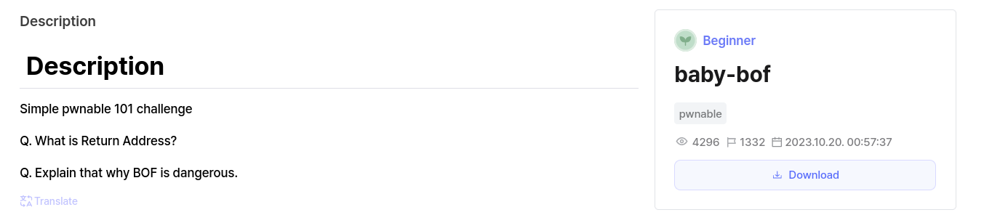

# Decription


## Source

```c
// gcc -o baby-bof baby-bof.c -fno-stack-protector -no-pie
#include <stdio.h>
#include <stdlib.h>
#include <unistd.h>
#include <string.h>
#include <fcntl.h>
#include <signal.h>
#include <time.h>

void proc_init ()
{
  setvbuf (stdin, 0, 2, 0); setvbuf (stdout, 0, 2, 0);
  setvbuf (stderr, 0, 2, 0);
}

void win () 
{
  char flag[100] = {0,};
  int fd;
  puts ("You mustn't be here! It's a vulnerability!");

  fd = open ("./flag", O_RDONLY);
  read(fd, flag, 0x60);
  puts(flag);
  exit(0);
}

long count;
long value;
long idx = 0;
int main ()
{
  char name[16];

  // don't care this init function
  proc_init (); 

  printf ("the main function doesn't call win function (0x%lx)!\n", win);

  printf ("name: ");
  scanf ("%15s", name);

  printf ("GM GA GE GV %s!!\n: ", name);

  printf ("|  addr\t\t|  value\t\t|\n");
  for (idx = 0; idx < 0x10; idx++) {
    printf ("|  %lx\t|  %16lx\t|\n", name + idx *8, *(long*)(name + idx*8));
  }

  printf ("hex value: ");
  scanf ("%lx%c", &value);

  printf ("integer count: ");
  scanf ("%d%c", &count);


  for (idx = 0; idx < count; idx++) {
    *(long*)(name+idx*8) = value;
  }

  
  printf ("|  addr\t\t|  value\t\t|\n");
  for (idx = 0; idx < 0x10; idx++) {
    printf ("|  %lx\t|  %16lx\t|\n", name + idx *8, *(long*)(name + idx*8));
  }

  return 0;
}
```

### Problem

Đọc sorce ta thấy rằng bài đọc và in flag trong hàm win. 
Trong hàm main, địa chỉ hàm win được in ra và in ra 1 loạt các địa chỉ khác từ biến name xuống.
Hàm scanf không giới hạn số lượng bytes nhập vào nên ta có thể overflow.
-> Ghì đè return bằng địa chỉ của win.


#### Solve

Tại yêu cầu nhập hex value: nhập địa chỉ của win
integer count:  a>=16


