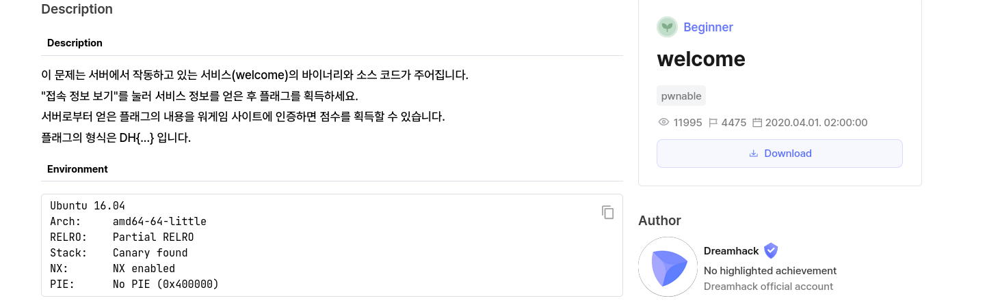

# Description


## Source
```c
#include <stdio.h>

int main(void) {
    FILE *fp;
    char buf[0x80] = {};
    size_t flag_len = 0;

    printf("Welcome To DreamHack Wargame!\n");

    fp = fopen("/flag", "r");
    fseek(fp, 0, SEEK_END);
    flag_len = ftell(fp);
    fseek(fp, 0, SEEK_SET);
    fread(buf, 1, flag_len, fp);
    fclose(fp);

    printf("FLAG : ");
    fwrite(buf, 1, flag_len, stdout);
}
```

### Problem
Chương trình đọc nội dung từ file /flag và in ra màn hình ngay sau dòng "FLAG : " bằng fwrite().
Vì không có cơ chế bảo vệ nào (như kiểm tra quyền truy cập hay mã hóa nội dung flag), flag được in ra một cách trực tiếp.

#### Solve

Dùng netcat để connect server 

Welcome To DreamHack Wargame!
FLAG : DH{XXXXXXXXXXXXXXXXXXXXXXXXX}

